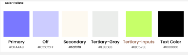

# Capítulo III: Solution UI/UX Design
## 3.1.Product design

### 3.1.1.Style Guidelines

En esta sección, el equipo establece un repositorio organizado y central de elementos comunes (assets, fonts, colores, iconografía) para mantener una presentación visual consistente y enfocada, alineada con el espíritu de Chapa tu Ruta: dinámico, confiable y cercano a la cultura popular peruana.

#### 3.1.1.1.General Style Guidelines

##### Branding
- Identidad visual moderna y profesional que transmite **confiabilidad**, **eficiencia** y **accesibilidad** en el transporte urbano.
- Iconografía clara e intuitiva: íconos simples y reconocibles para acciones principales (rutas, paradas, vehículos, perfil).

 

 ##### Typography
 - Tipografías sans-serif de alta legibilidad optimizadas para dispositivos móviles.
- Sistema de jerarquía tipográfica:
  - **Títulos principales**: Bold, tamaño grande para encabezados de pantalla
  - **Subtítulos**: Semi-bold para secciones y tarjetas
  - **Texto general**: Regular para contenido de lectura
  - **Labels**: Medium para etiquetas de formularios
 
##### Colors
- Paleta de colores basada en tonos violeta/púrpura como color principal:
  - **Primario**: Violeta (#6B4CE6 aproximadamente) - botones principales, elementos activos
  - **Secundarios**: Tonos claros de violeta para fondos y estados hover
  - **Neutros**: Blanco, grises claros para fondos y tarjetas
  - **Accentos**: Verde para estados de éxito, rojo para alertas
  - Los colores transmiten **profesionalismo, confianza y modernidad**
 
   
 
##### Spacing
- Sistema de espaciado consistente:
  - Padding interno de tarjetas: 16px - 24px
  - Separación entre elementos: 12px - 16px
  - Márgenes laterales: 16px - 20px
  - Espacios que mantienen sensación de **orden y claridad visual**

##### Communication Tone
- Tono de comunicación:
  - **Claro y directo** en instrucciones
  - **Amigable pero profesional** en mensajes
  - **Conciso** en labels y descripciones
  - Uso de lenguaje **accesible** para usuarios urbanos

##### Dimension Guidelines
- Componentes de UI con dimensiones estándar:
  - **Botones principales**: Altura 48px - 56px (óptimo para touch)
  - **Íconos**: 24px - 32px
  - **Inputs de texto**: Altura 48px - 56px
  - **Tarjetas de información**: Width: full screen con padding lateral
  - **Bottom Navigation Bar**: Altura 56px - 64px
 
 

### 3.1.2.Information Architecture

### 3.1.2.1.Organization Systems

**Jerárquico (Visual Hierarchy):**
Se utiliza para destacar información clave como rutas disponibles, detalles de paradas y vehículos. Las pantallas principales (Home, Routes) muestran la información más relevante primero.

**Secuencial (Step-by-Step):**
Implementado en:
- Proceso de registro de usuario
- Creación y edición de perfiles
- Creación de nuevas rutas y paradas (para conductores/gestores)
- Edición de información de vehículos

**Por Tópicos:**
La información se agrupa en secciones claras:
- **Routes**: Gestión de rutas
- **Stops**: Información de paradas
- **Vehicles**: Gestión de vehículos
- **Profile**: Configuración de usuario

**Según Audiencia:**
- **Conductores**: Acceso a creación y edición de rutas, paradas y vehículos
- **Pasajeros**: Acceso a visualización de rutas, búsqueda y navegación

#### 3.1.2.2.Labelling Systems

Etiquetas diseñadas para ser claras y autoexplicativas:

**Ejemplos de Etiquetas:**
- "Welcome" / "Create your account" (pantallas de autenticación)
- "Edit Profile" / "Edit Vehicle" (acciones de edición)
- "Route Card" / "Stop Card" (componentes visuales)
- "Name" / "Email" / "Password" / "National ID" (campos de formulario)
- "Home" / "Routes" / "Stops" / "Profile" (navegación principal)

**Asociaciones:**
- "Routes" vinculado con "Stops" y "Maps"
- "Vehicles" asociado con "Routes" y "Drivers"
- "Profile" relacionado con configuración de usuario

#### 3.1.2.3.SEO Tags and Meta Tags

**Landing Page:**
- **Title:** "Chapa tu Ruta - Transporte urbano moderno y confiable"
- **Meta Description:** "Encuentra rutas, horarios y paradas de transporte público. Gestiona tu servicio de transporte de manera eficiente."
- **Keywords:** transporte urbano, rutas, paradas, transporte público, movilidad urbana, gestión de rutas
- **Author:** Equipo Chapa tu Ruta

**Aplicación Móvil:**
- **Title (Routes):** "Mis Rutas | Chapa tu Ruta"
- **Meta Description:** "Gestiona y visualiza tus rutas de transporte. Crea y edita rutas fácilmente."

#### 3.1.2.4.Searching Systems

Sistema de búsqueda implementado en:

**Búsqueda por Filtros:**
- Origen y destino de rutas
- Tipo de vehículo
- Horarios disponibles
- Paradas cercanas

**Resultados de Búsqueda:**
Mostrados en tarjetas con información clave:
- Nombre de la ruta
- Puntos de inicio y fin
- Duración estimada
- Disponibilidad

**Navegación por Mapa:**
Visualización de rutas y paradas en mapa interactivo (visible en las pantallas de mapas del Figma)

#### 3.1.2.5.Navigation Systems

Sistema de búsqueda implementado en:

**Búsqueda por Filtros:**
- Origen y destino de rutas
- Tipo de vehículo
- Horarios disponibles
- Paradas cercanas

**Resultados de Búsqueda:**
Mostrados en tarjetas con información clave:
- Nombre de la ruta
- Puntos de inicio y fin
- Duración estimada
- Disponibilidad

**Navegación por Mapa:**
Visualización de rutas y paradas en mapa interactivo (visible en las pantallas de mapas del Figma)

### 3.1.3.Landing Page UI Design

#### 3.1.3.1.Landing Page Wireframe

#### Full landing page wireframe design

#### a. Hero section wireframe

#### b. Como funciona section wireframe

#### c. Ventajas section wireframe

#### d. FAQ section wireframe

#### e. Footer section wireframe

#### 3.1.3.2.Landing Page Mock-up

#### Full landing page design

#### a. Hero section design

#### b. Como funciona section design

#### c. Ventajas section design

#### d. FAQ section design

#### e. Footer section design

### 3.1.4.Mobile Applications UX/UI Design

#### 3.1.4.1.Mobile Applications Wireframes

#### 3.1.4.2.Mobile Applications Wireflow Diagrams

#### 3.1.4.3.Mobile Applications Mock-ups

#### 3.1.4.4.Mobile Applications User Flow Diagrams

#### 3.1.4.5.Mobile Applications Prototyping
