# Capítulo III: Solution UI/UX Design
## 3.1.Product design

### 3.1.1.Style Guidelines

#### 3.1.1.1.General Style Guidelines

### 3.1.2.Information Architecture

### 3.1.2.1.Organization Systems

#### 3.1.2.2.Labelling Systems

#### 3.1.2.3.SEO Tags and Meta Tags

#### 3.1.2.4.Searching Systems

#### 3.1.2.5.Navigation Systems

### 3.1.3.Landing Page UI Design

#### 3.1.3.1.Landing Page Wireframe

#### 3.1.3.2.Landing Page Mock-up

### 3.1.4.Mobile Applications UX/UI Design

#### 3.1.4.1.Mobile Applications Wireframes

#### 3.1.4.2.Mobile Applications Wireflow Diagrams

#### 3.1.4.3.Mobile Applications Mock-ups

**Login and Register**

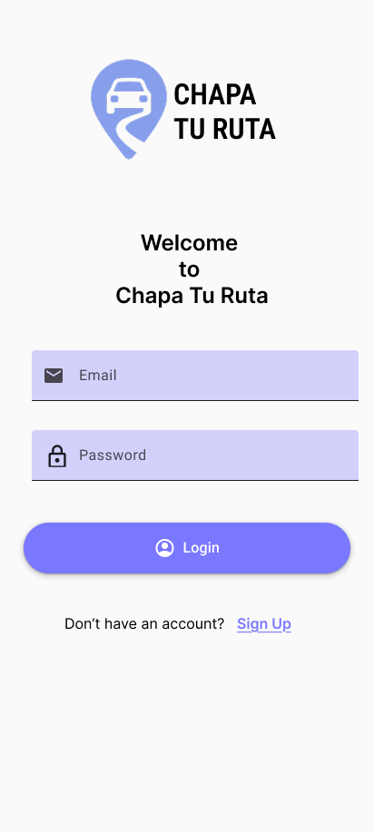
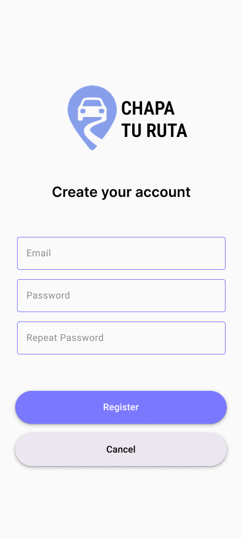

**Home**

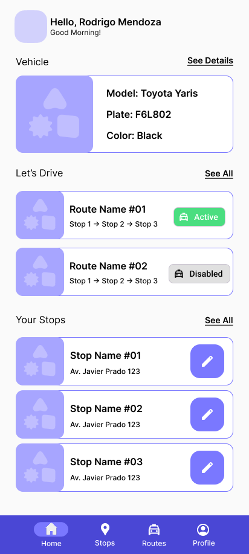

**Stops**

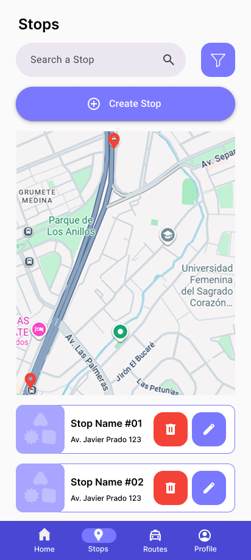
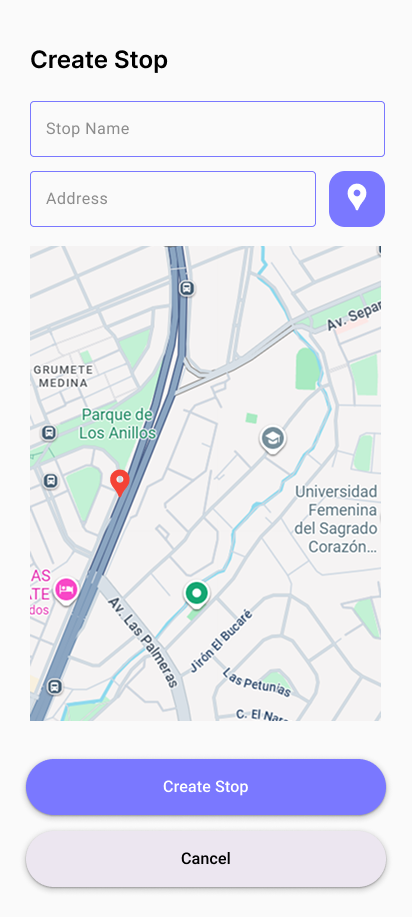
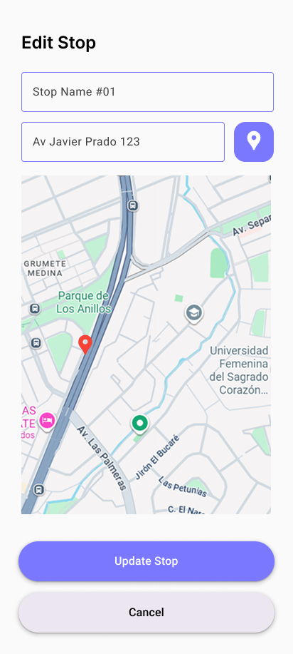

**Routes**

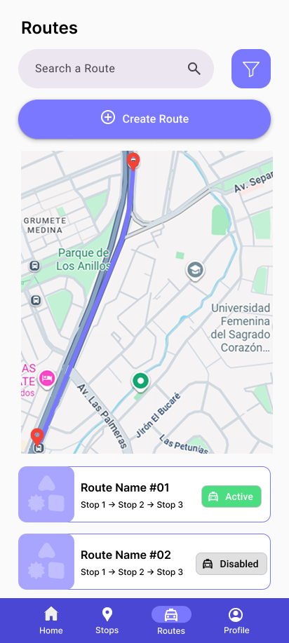
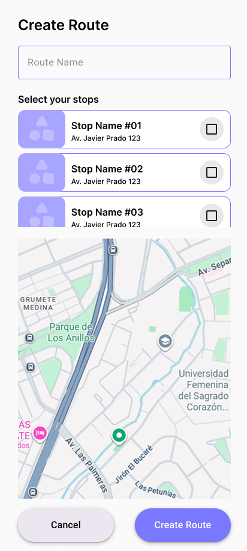
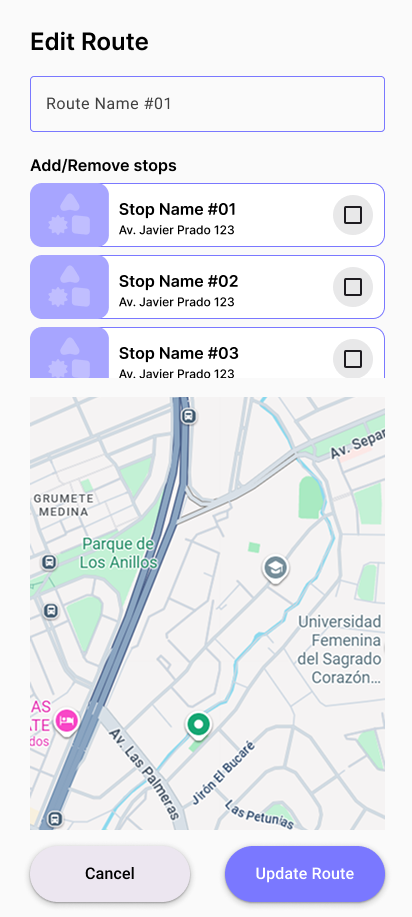

**Profile**

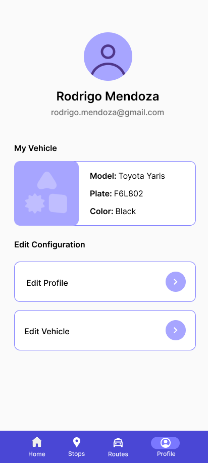
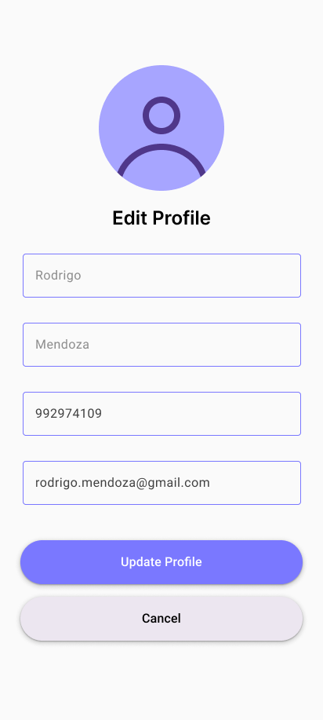
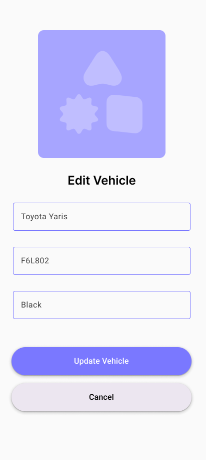

#### 3.1.4.4.Mobile Applications User Flow Diagrams

#### 3.1.4.5.Mobile Applications Prototyping

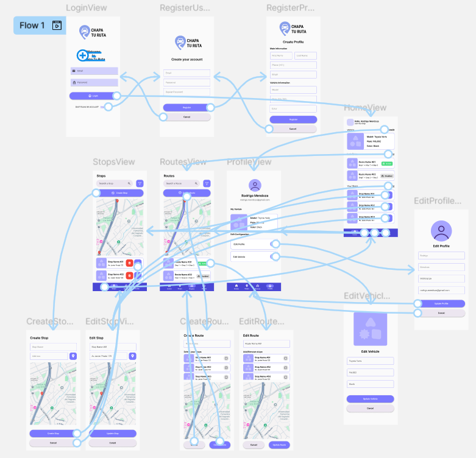

Link del Prototipo: [https://www.figma.com/proto/ogKCZcKoFNJczb2QF6g0oX/Aplicaciones-Moviles---Grupo-2?node-id=37-921&p=f&t=qlRYowPt05w3zXVe-1&scaling=scale-down&content-scaling=fixed&page-id=37%3A908&starting-point-node-id=37%3A941](https://www.figma.com/proto/ogKCZcKoFNJczb2QF6g0oX/Aplicaciones-Moviles---Grupo-2?node-id=37-921&p=f&t=qlRYowPt05w3zXVe-1&scaling=scale-down&content-scaling=fixed&page-id=37%3A908&starting-point-node-id=37%3A941)