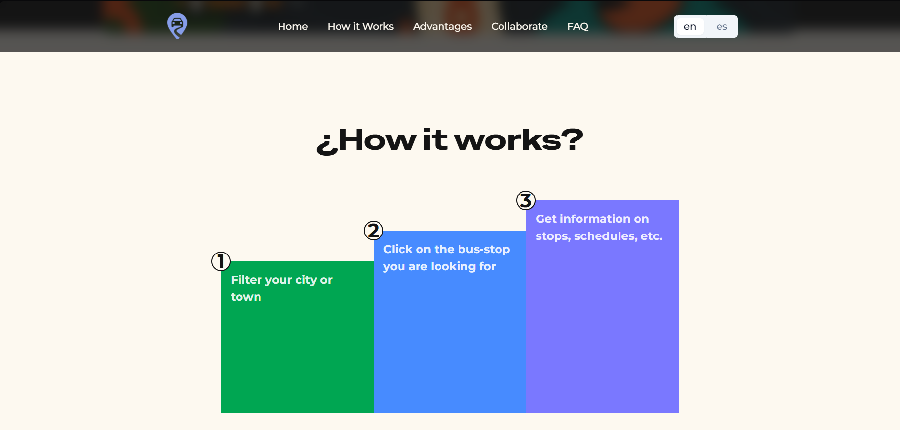
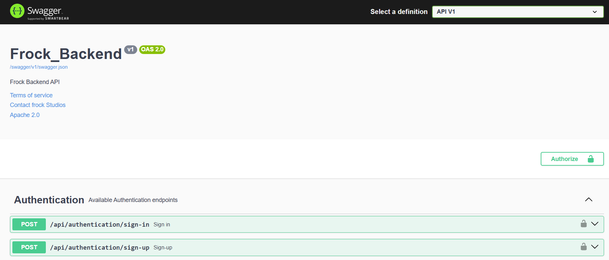
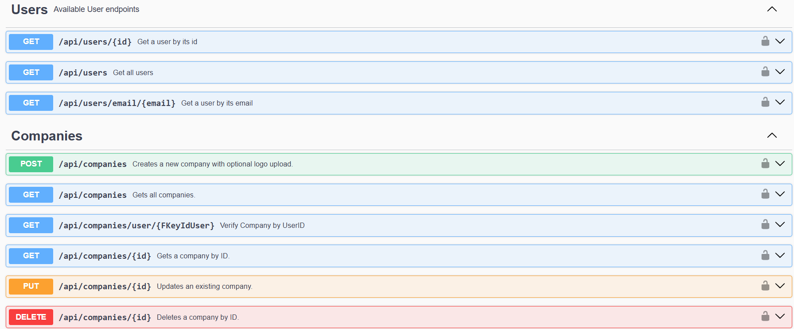
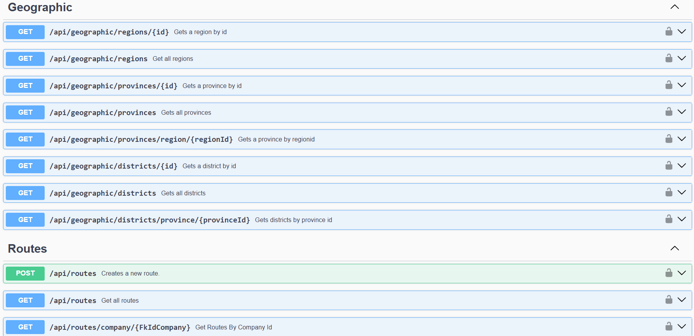
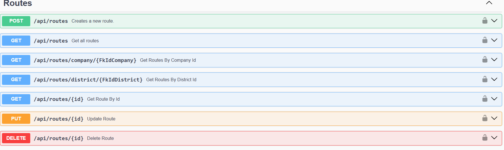
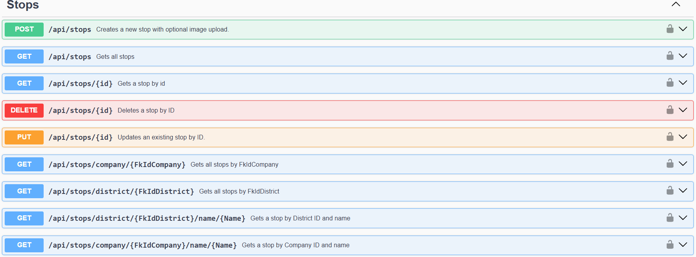
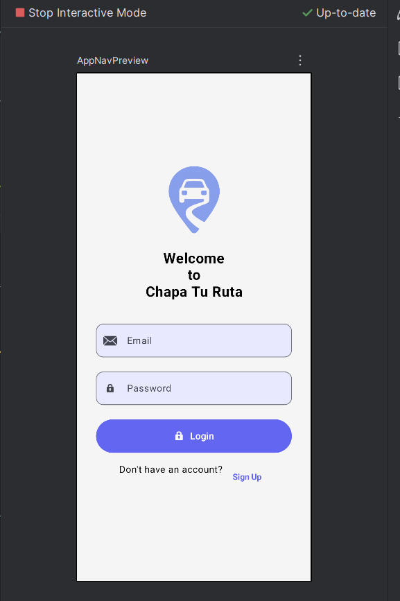
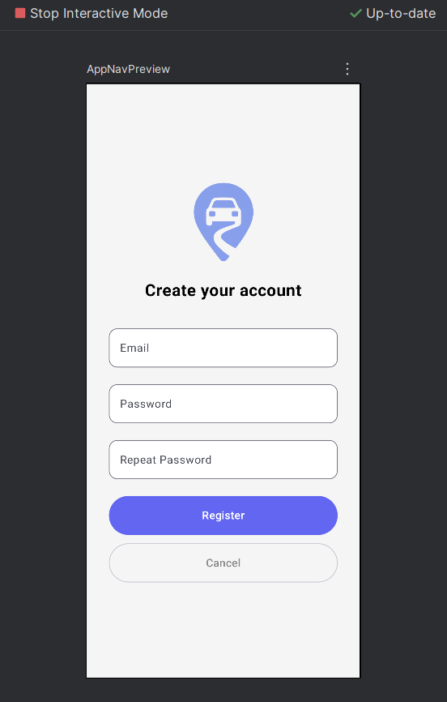
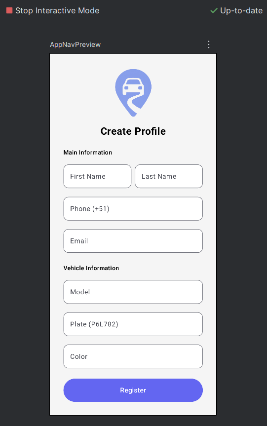
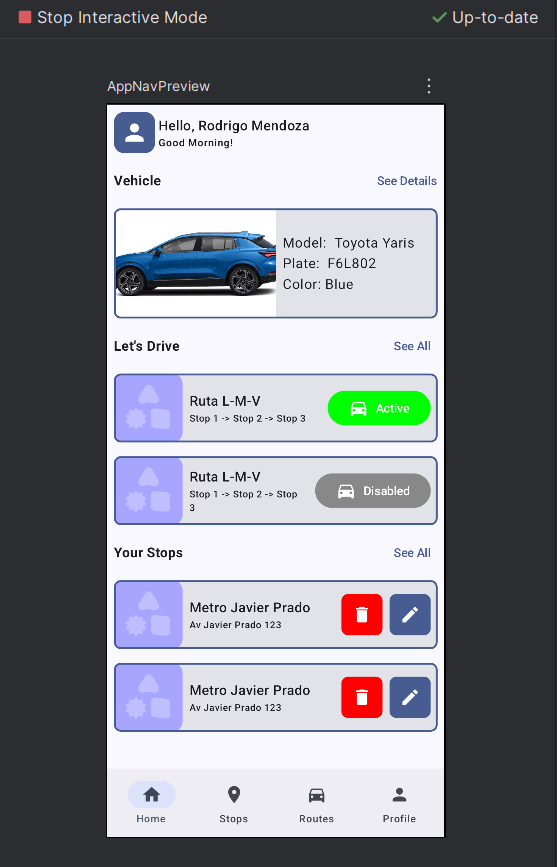

# Capítulo IV: Product Implementation & Validation

## 4.1.Software Configuration Management

### 4.1.1.Software Development Environment Configuration

Para asegurar una colaboración eficiente y mantener la calidad en el desarrollo de **Chapa Tu Ruta**, se ha definido un entorno de desarrollo común para todos los miembros del equipo. A continuación, se listan los productos de software utilizados en las distintas etapas del ciclo de vida del producto digital, indicando su propósito y su enlace de referencia o descarga correspondiente.

**Product UX/UI Design**

Para el diseño de la experiencia de usuario y la interfaz de la Landing page de Eventify, se utilizaron las siguientes herramientas:

- Figma: Se empleó para la creación de wireframes, mock-ups y prototipos de la aplicación web.[https://www.figma.com/es-es/](https://www.figma.com/es-es/)
- UXPressia: Utilizada para elaborar User Personas, Empathy Maps, Journey Maps e Impact Maps. [https://uxpressia.com/](https://uxpressia.com/)
- Miro: Se utilizó para la creación de Event Storming, Domain Message Flow Modelling, Bounded Context Canvases. [https://miro.com/es/](https://miro.com/es/)

**Software Development**

Para el desarrollo del software del Landing Page, Backend y Mobile App, se adoptaron los siguientes productos:

- WebStorm (Instalación local): Utilizado como entorno de desarrollo para trabajar con HTML, CSS y JavaScript. [https://www.jetbrains.com/es-es/webstorm/](https://www.jetbrains.com/es-es/webstorm/)
- Android Studio (Instalación local): Este es un IDE para desarrollar aplicaciones móviles para Android, utilizando Kotlin y JetPack Compose. [https://developer.android.com/studio?hl=es-419](https://developer.android.com/studio?hl=es-419)
- Rider(Instalación local): Utilizamos este IDE para desarrollar el backend de la aplicación. [https://www.jetbrains.com/es-es/rider](https://www.jetbrains.com/es-es/rider)
- Git (Instalación local): Empleado para gestionar los cambios de código de manera local mediante commits y ramas. [https://git-scm.com/](https://git-scm.com/)
- GitHub: Plataforma de repositorio remoto para la gestión de versiones del código, implementando el flujo GitFlow para garantizar un desarrollo organizado. [https://github.com/](https://github.com/)

**Project Management and Collaboration**

En la gestión de proyectos y colaboración del equipo se utilizaron:

- **Trello:** Utilizado para la planificación y seguimiento de tareas, distribuidas en listas de "por hacer", "en progreso" y "hecho".
- **WhatsApp:** Medio de comunicación instantánea para coordinar avances, resolver dudas rápidas y hacer recordatorios. [https://web.whatsapp.com/](https://web.whatsapp.com/)
- **Google Meet:** Herramienta utilizada para realizar reuniones virtuales más formales, presentaciones de avances y coordinación general del equipo. [https://www.zoom.com/es](https://www.zoom.com/es)

**Software Documentation**

Para la documentación del proyecto se emplearon las siguientes herramientas:
 
- Lucidchart: Utilizada para la creación de diagramas UML, wireflows y user flows que ayudan en la planificación y visualización del sistema. [https://www.lucidchart.com/pages](https://www.lucidchart.com/pages)
- Visual Paradigm: Herramienta usada para modelar la arquitectura de software mediante diagramas C4. [https://online.visual-paradigm.com/drive/#proj=0&dashboard](https://online.visual-paradigm.com/drive/#proj=0&dashboard)


### 4.1.2.Source Code Management

La gestión del código fuente es una parte fundamental en el desarrollo colaborativo de software, ya que permite un control eficiente sobre las modificaciones realizadas en el proyecto a lo largo de su ciclo de vida. En esta sección del informe, se describe el sistema de control de versiones implementado en el proyecto Chapa Tu Ruta, utilizando GitHub como plataforma principal. Además, se detallan las convenciones de trabajo adoptadas por el equipo, como el modelo GitFlow, el versionado semántico (Semantic Versioning) y las convenciones de commit mediante Conventional Commits. Estas prácticas aseguran un desarrollo ordenado y una integración continua efectiva entre los miembros del equipo.

**URL de los Repositorios:**
- Organización: [https://github.com/Aplicaciones-Moviles-Grupo](https://github.com/Aplicaciones-Moviles-Grupo)
- Reporte: [https://github.com/Aplicaciones-Moviles-Grupo/Report](https://github.com/Aplicaciones-Moviles-Grupo/Report)
- Landing Page: [https://github.com/Aplicaciones-Moviles-Grupo/landing-page-original](https://github.com/Aplicaciones-Moviles-Grupo/landing-page-original)
- Backend: [https://github.com/Aplicaciones-Moviles-Grupo/back-end](https://github.com/Aplicaciones-Moviles-Grupo/back-end)
- Aplicación Movil: [https://github.com/Aplicaciones-Moviles-Grupo/ChapaTuRuta-MobileApp](https://github.com/Aplicaciones-Moviles-Grupo/ChapaTuRuta-MobileApp)

**Estructura de Ramas:**

Para mantener un flujo organizado en el desarrollo y facilitar la colaboración, se ha implementado el modelo GitFlow, creando las siguientes ramas:

- Main Branch: Rama principal (main) que contiene las versiones estables del proyecto. Todas las demás ramas derivan de esta.
- Develop: Rama secundaria donde se integran todas las características nuevas antes de fusionarse a la rama main.
- Feature Branches: Estas ramas se crean a partir de develop y son en base a las características del proyecto. Una vez se termina de trabajar en la rama, se hace merge hacia develop.

**Convenciones de commits:**

Para la escritura de commits en el proyecto Eventify, se sigue la convencion 'Conventional Commits', el cual cuenta con un formato estándar para facilitar la lectura y entendimiento del historial de cambios dentro del proyecto.
```
    <type>[optional scope]: <description>
    
    [optional body]
    
    [optional footer(s)]
```
- Type:
    - feat: Añadir una nueva característica.
    - fix: Correción de errores.
    - docs: Modificaciones en la documentación.
    - style: Cambios que no afectan la lógica del código.
    - refactor: Modificaciones que no añaden características y/o errores.
    - test: Adición/Modificación de pruebas.


- Scope: Brinda información extra acerca del área del codigo afectado.
```
   feat(auth): add register functionality.
```
**Ejemplos básicos de commits:**
```
   feat(login): add organizer authentication module.
```
```
   fix(payment): resolve payment security issue.
```
```
   docs(README): update index instructions.
```

### 4.1.3.Source Code Style Guide & Conventions
Para el desarrollo de Chapa Tu Ruta, se han adoptado las siguientes guías de estilo y convenciones de codificación para
asegurar la consistencia y calidad del código en todo el proyecto:<br>
**HTML**<br>
Durante el desarrollo en HTML se aplicaron las Convenciones de Codificación establecidas para este lenguaje, integrando 
además el uso del framework Vue junto con Vite para optimizar el rendimiento y la organización del proyecto. 
Los aspectos más relevantes implementados son:

* Empleo de etiquetas semánticas: Se utilizaron elementos como header, nav, main y footer con el propósito de mejorar 
la accesibilidad, la estructura y la comprensión del contenido del documento.

* Estructura e indentación: Aunque HTML permite el uso indistinto de mayúsculas y minúsculas en los nombres de etiquetas
y atributos, se decidió emplear únicamente minúsculas para mantener la claridad y uniformidad del código. Asimismo, 
se adoptó la convención kebab-case para garantizar coherencia en la nomenclatura y facilitar el mantenimiento del proyecto.

**CSS**<br>
**CSS**

En el desarrollo de los estilos se siguieron las **convenciones BEM** y las **guías de estilo recomendadas**, con el propósito de mantener un código estructurado, legible y fácil de mantener. Además, se emplearon **variables personalizadas en `:root`** para definir la paleta de colores y las transiciones del sitio, lo que permite una gestión más eficiente del diseño y facilita futuras modificaciones.

### Principales características implementadas

- **Uso de variables CSS personalizadas:**  
  En el selector `:root` se declararon múltiples variables (`--cl-orange`, `--cl-purple`, `--cl-green`, etc.) para estandarizar la paleta de colores y asegurar coherencia visual en toda la interfaz.

- **Compatibilidad con modo claro y oscuro:**  
  Se utilizó la regla `@media (prefers-color-scheme: light)` para ajustar automáticamente los colores del sitio según la preferencia del usuario, mejorando la accesibilidad y experiencia visual.

- **Tipografía y legibilidad:**  
  Se definió una jerarquía tipográfica clara empleando fuentes del sistema y ajustes de renderizado (`-webkit-font-smoothing`, `-moz-osx-font-smoothing`) para optimizar la legibilidad en diferentes dispositivos.

- **Diseño responsivo:**  
  Se incluyeron márgenes dinámicos (`--sideMargin`, `--sideMarginMobile`) y transiciones suaves (`--n-out`, `--n-in-out`) para adaptar el contenido a distintos tamaños de pantalla, manteniendo una apariencia consistente.

- **Transiciones y efectos interactivos:**  
  Los botones (`button`) cuentan con **transiciones suaves y efectos hover**, aportando dinamismo y una mejor experiencia de usuario.

En conjunto, este enfoque garantiza un diseño moderno, coherente y adaptable, alineado con las buenas prácticas de desarrollo frontend.

**JavaScript**

Para la parte funcional del proyecto se utilizó **JavaScript** junto con el **framework Vue 3** y el **empaquetador Vite**, lo que permitió un desarrollo modular, rápido y eficiente.  
El código principal inicializa la aplicación, configura dependencias y registra los componentes visuales.

### Principales características implementadas

- **Inicialización del proyecto con Vue 3:**  
  La aplicación se crea mediante la función `createApp(App)`, que establece la estructura base del proyecto y monta la interfaz en el elemento raíz identificado como `#app`.

- **Integración del framework PrimeVue:**  
  Se incorporó **PrimeVue** como biblioteca principal de componentes UI, configurada con el **tema Aura** para garantizar una estética moderna y coherente.  
  La personalización del tema se definió a través de opciones como `prefix`, `darkModeSelector` y `cssLayer`, adaptando la integración al diseño del sitio.

- **Internacionalización (i18n):**  
  Se implementó el módulo `i18n.js` para manejar la **traducción de contenidos** entre diferentes idiomas, optimizando la experiencia del usuario en contextos multilingües.

- **Registro de componentes globales:**  
  Los componentes `Button` y `SelectButton` de PrimeVue fueron registrados globalmente bajo los nombres `pb-Button` y `pb-SelectButton`, facilitando su reutilización en distintas secciones del proyecto.

- **Importación modular de estilos:**  
  Los estilos globales se administran a través del archivo `style.css`, que se integra en la aplicación para mantener la coherencia visual junto con las configuraciones de tema y tipografía.

En conjunto, este enfoque permite mantener un código **escalable, limpio y orientado a componentes**, alineado con las mejores prácticas de desarrollo frontend moderno.

### 4.1.4.Software Deployment Configuration


## 4.2.Landing Page & Mobile Application Implementation

### 4.2.1.Sprint 1

#### 4.2.1.1.Sprint Planning 1

#### 4.2.1.2.Sprint Backlog 1

#### 4.2.1.3.Development Evidence for Sprint Review

#### 4.2.1.4.Testing Suite Evidence for Sprint Review

#### 4.2.1.5.Execution Evidence for Sprint Review

Durante este primer Sprint logramos realizar la implementación del Landing page, Backend y Mobile App, sin embargo este último por el momento se realizó de forma local.

A continuación se presentan evidencias de ejecución de los 3 productos:


**Landing Page**

**Hero Section**: En esta sección se colocó un mensaje que atraiga la atención del visitante, junto con un boton call to action para posteriormente enviarlo a la aplicación movil desplegada. 


**How It Works Section**: En esta sección se le presenta como funciona la app para que el usuario obtenga información sobre las rutas y paraderos de los colectivos 



**Advantages Section**: Se presentan los beneficios que ofrece la aplicación para facilitar la búsqueda de colectivos


**FAQ Section**: Se muestran las preguntas frecuentes que realizan los visitantes cuando visitan por primera vez la página


**Footer Section**: Finalmente en el footer se presenta información de contacto como redes sociales, numero de telefono, etc.


**Backend**











**Mobile App**










#### 4.2.1.6.Services Documentation Evidence for Sprint Review

#### 4.2.1.7.Software Deployment Evidence for Sprint Review

#### 4.2.1.8.Team Collaboration Insights during Sprint
